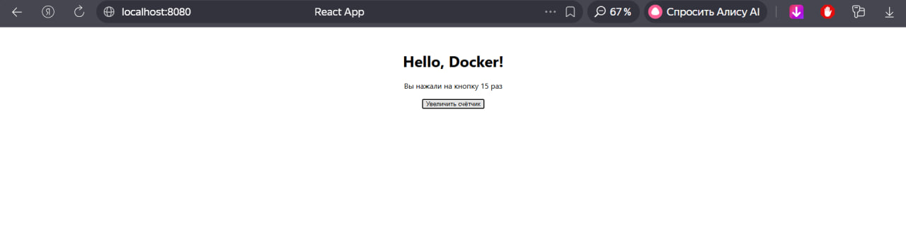

# My Dockerized React App
Простое React-приложение, работающее внутри Docker-контейнера.

## Скриншот


## Инструкция по сборке
```bash
docker build -t my-react-app .

docker run -p 8080:80 my-react-app

После запуска приложение доступно по адресу: http://localhost:8080.

